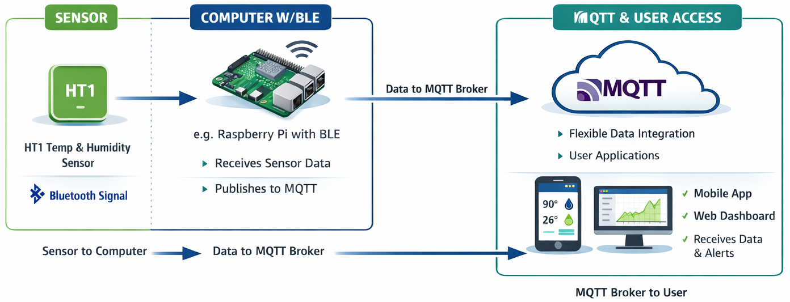

# SensorPush HT1 - BLE Protocol Reverse Engineering
<p align="center">
  
</p>
<strong><span style="color:red">STATUS:</span></strong> Both direct live readings and full history download solved. No WiFi API/Gateway needed.

| # | Data | Source | Status |
|---|------|--------|--------|
| 1 | Temperature (live) | BLE advertisement | ✅ Fully decoded |
| 2 | Humidity (live) | BLE advertisement | ✅ Fully decoded |
| 3 | Temperature (history) | GATT ef09000a notify | ✅ Fully decoded |
| 4 | Humidity (history) | GATT ef09000a notify | ✅ Fully decoded |
| 5 | Device ID | GATT ef090001 | ✅ Fully decoded |
| 6 | Battery voltage | GATT ef090007 | ✅ Decoded (`raw × 3.6 / 1024`) |
| 7 | Battery level % | GATT ef090003 | ⚠️ Readable, formula TBD |
| 8 | Unknown | GATT ef090005 | ❌ Not yet decoded |
| 9 | Unknown | GATT ef090006 | ❌ Not yet decoded |
| 10 | Unknown notify | GATT ef09000b | ❌ Not yet decoded |

---

## Overview

The SensorPush HT1 is a precision Bluetooth Low Energy temperature and humidity sensor
built for real-world deployment. It records data every minute, stores 20 days of history
on-board, and continuously broadcasts live readings in its BLE advertisements...all from
a coin cell battery rated for 1–2 years of typical use.

**Technical specifications:**

| Specification | Value |
|--------------|-------|
| Temperature range | -40°C to 60°C (-40°F to 140°F) |
| Temperature accuracy | ±0.3°C / ±0.5°F typical · ±0.5°C / ±0.9°F max |
| Humidity range | 0–100% RH |
| Humidity accuracy | ±3% typical · ±4.5% max (at 25°C, 20–80% RH) |
| Sampling interval | Every 60 seconds |
| On-board storage | 20 days |
| Battery | CR2477 (included, user-replaceable) |
| Battery life | 1–2 years typical |
| Wireless range | 100 m line-of-sight |
| Dimensions | 40 × 40 × 16.5 mm (1.57" × 1.57" × 0.65") |
| Weight | 40 g (1.4 oz) |

### A Note on the Hardware Engineering

Before getting into the reverse engineering: the HT1 is a genuinely well-engineered
piece of hardware, and it deserves to be recognized as such.

Opening the enclosure reveals a textbook example of thoughtful embedded design packed
into a coin-sized board:

- **CR2477 battery**...an unusually large coin cell for a device this size. The CR2477
  has roughly 3× the capacity of the CR2032 used in most comparable sensors. Paired with
  the nRF51822's aggressive sleep modes, this translates to the 1–2 year battery life
  advertised...and often longer in practice. The engineers clearly prioritized longevity
  over BOM cost, and they had the confidence to back it up with a spec sheet guarantee.

- **PCB trace antenna**...a full-perimeter ring trace tuned for 2.4 GHz. The RF
  validation clearly went well: the two antenna matching network pads on the board edge
  are unpopulated, meaning the trace hit impedance spec without correction components.
  Getting that right the first time takes careful simulation and layout discipline. The
  100-meter line-of-sight range claim isn't marketing; the antenna earns it.

- **SHT20 placement**...the humidity sensor sits in a precision circular cutout in the
  PCB that aligns directly with an ingress port in the enclosure. Ambient air reaches the
  sensor element unobstructed while the rest of the board stays isolated. This isn't an
  afterthought...it's a mechanical and electrical design decision made together, and it
  shows in the ±3% accuracy figure.

- **SWD pads...through-hole, both sides**...the 2×2 SWD debug header is through-hole
  rather than SMD, accessible from both faces of the PCB. The production programming
  fixture doesn't need to flip the board. Small thing, faster line.

- **nRF51822 SoC choice**...ARM Cortex-M0 with integrated BLE radio, 256KB flash, 16KB
  RAM. Exactly the right part for a coin-cell sensor: deep sleep current measured in
  microamps, sufficient flash for weeks of history at 1-minute intervals, and a mature
  Nordic SoftDevice BLE stack. No over-engineering, no wasted margin.

- **Enclosure**...plastic clip retention (no screws, no adhesive), a precise humidity
  ingress port, and a lanyard loop for versatile mounting. It opens cleanly with a
  spudger and reassembles without complaint. The vent is even documented as
  "ideally facing downward" for outdoor protected use...this level of user-guidance
  detail reflects the same care as the hardware.

The HT1 is rated for use in freezers, refrigerators, attics, basements, wine cellars,
greenhouses, reptile terrariums, guitar cases, cigar humidors, RVs, and chicken brooders.
The -40°C floor and ±0.3°C typical accuracy make that list credible, not aspirational.

The SensorPush HT1 is the product of people who knew what they were doing. Reverse
engineering it was a pleasure precisely because the design is coherent and deliberate.
Every decision has a reason. That's rarer than it should be.

### The People Behind It


SensorPush was created by **Jonathan Cousins** and **James Nick Sears** of
[Cousins & Sears Creative Technologists](https://cousinsandsears.com), a small Brooklyn, NY-based
studio with an unusually wide skill set...firmware, app development, electrical engineering,
and a background in design that shows in every detail of the finished product.

What stands out about the HT1 is that it feels deliberate at every level. The firmware is
lean, the app is polished, and the hardware makes no wasted moves. That kind of coherence
is hard to fake and harder to manufacture by committee. It comes from a small team that
cared enough to get the details right.

The fact that two people in Brooklyn built a sensor that competes...on accuracy, range,
battery life, and build quality...with products from companies many times their size says
everything about the quality of their work.

The reverse engineering documented in this repository is a tribute to their work as much
as anything else. A poorly engineered product is a chore to analyze. The HT1 was a joy.

---

**End result:** Two standalone Python scripts that give complete, cloud-free access:

| Script | What it does |
|--------|-------------|
| `scripts/read_ht1.py` | Live readings from passive BLE advertisements |
| `scripts/ht1_history.py` | Full historical data via GATT (weeks of 1-minute readings) |

No pairing. No cloud account. No SensorPush app required.

---

## Quick Start

```bash
pip install bleak

# Live reading (current temp/humidity)
python3 scripts/read_ht1.py

# Full history download
python3 scripts/ht1_history.py --csv history.csv

# History since a date
python3 scripts/ht1_history.py --since 2026-03-10 --json out.json

# Publish to MQTT...broker on command line
python3 scripts/read_ht1.py --mqtt --mqtt-host mqtt.local --mqtt-topic home/ht1
python3 scripts/ht1_history.py --mqtt --mqtt-host mqtt.local --mqtt-user admin --mqtt-pass secret

# MQTT config can also be set via env vars (useful for service deployments)
# MQTT_HOST, MQTT_PORT, MQTT_USER, MQTT_PASS, MQTT_TOPIC_PREFIX
# Run with -h for full option list
```

---

## The Protocol

### Device Identification

| Property | Value |
|----------|-------|
| BLE local name | `"s"` |
| Service UUID | `ef090000-11d6-42ba-93b8-9dd7ec090aa9` |
| MAC (this device) | `XX:XX:XX:XX:XX:XX` |

### Live Readings...Advertisement Data

The HT1 continuously broadcasts sensor data in its BLE advertisement payload.
No connection or pairing needed.


**Decode:**
```python
hum_raw  = b0 + ((b1 & 0x0F) << 8)
temp_raw = (b1 >> 4) + (b2 << 4) + ((b3 & 0x03) << 12)
humidity = round(max(0.0, min(100.0, -6.0 + 125.0 * hum_raw  / 4096.0)), 2)
temp_c   = round(-46.85 + 175.72 * temp_raw / 16384.0, 2)
temp_f   = round(temp_c * 9/5 + 32, 2)
```

### History Download...GATT Protocol

**Characteristics:**
| UUID | Direction | Purpose |
|------|-----------|---------|
| `ef090009-11d6-42ba-93b8-9dd7ec090aa9` | Write-with-response | Send command |
| `ef09000a-11d6-42ba-93b8-9dd7ec090aa9` | Notify + Read | Receive data |

**Trigger command:** Write `0x01000000` (uint32 little-endian) to ef090009.


**Key protocol facts:**
- Records within each packet advance forward in time (+60 seconds each)
- Packets are delivered **newest-first** (timestamps decrease across packets)
- `0xFFFFFFFF` in any record slot = end of history sentinel
- Sensor stores approximately 3+ weeks of 1-minute readings
- No authentication or pairing required...any BLE central can issue the command

**Validated (2026-03-12):** Downloaded 5,656 records spanning March 8–12, 2026.

### Other GATT Characteristics

| UUID | Purpose | Status |
|------|---------|--------|
| ef090001 | Device ID (uint24) | ✅ Decoded |
| ef090003 | Battery level (%) | ✅ Readable, exact meaning TBD |
| ef090007 | Battery ADC raw | ✅ formula: `raw * 3.6 / 1024` |
| ef090005 | Unknown | Not yet decoded |
| ef090006 | Unknown | Not yet decoded |
| ef09000b | Unknown notify | Not yet decoded |

---

## Research Journey...How We Got Here

This took two dedicated sessions and more dead ends than expected.
The full 8-hour Lenovo tablet session is documented in
[`docs/lenovo_tablet_session_2026-03-12.md`](docs/lenovo_tablet_session_2026-03-12.md).

### Phase 1...Direct GATT Connection, Wrong Formula (FAILED, early March 2026)

First attempt: connect directly via Python `bleak`, read ef09000a, try to decode.

**Result:** Connected successfully, read data, but temperature was off by 5.5°F.
The decode formula was wrong...we had no reference to validate against.

**Files:** `scripts/ht1_direct_connection.py`

---

### Phase 2...nRF52840 WHAD External Sniffer (FAILED)

Flashed a Taidacent nRF52840 dongle with Butterfly firmware, ran WHAD framework
to sniff BLE traffic between iPhone and HT1.

**Result:** 0 packets captured across 7+ connection attempts.

**Root cause:** The HT1 uses *directed* BLE advertising to its bonded phone.
Directed advertisements are invisible to external scanners. Only the bonded device
can see them.

**Files:** `scripts/capture_ht1_whad_*.py`, `hardware/nrf52840_butterfly_setup.md`

---

### Phase 3...Android-x86 VM HCI Snoop (FAILED)

Ran Android-x86 in a Proxmox VM with Bluetooth USB passthrough, enabled
HCI snoop logging.

**Result:** SensorPush app crashed immediately on launch..."keeps stopping."

**Root cause:** SensorPush ships ARM-only native libraries.
Android-x86 cannot execute ARM code; there's no runtime translation layer.

**Files:** `docs/android_x86_vm_failure.md`

---

### Phase 4...Raspberry Pi btmon (FAILED)

Used `btmon` on a Raspberry Pi 3B+ running Kali Linux.

**Result:** Captured only the file header. No BLE traffic.

**Root cause:** `btmon` captures your *own* adapter's traffic.
It cannot see what's happening between a phone and an external BLE device.

---

### Phase 5...Samsung Galaxy S6 HCI Snoop (FAILED)

Ordered a $49 Samsung Galaxy S6 specifically for HCI snoop capture.

**Result:** SensorPush app blocked at startup with `MessageGuardException`.

**Root cause:** The unit delivered was a TracFone carrier variant (SM-S906L)
permanently stuck on Android 5.0.2 (API 21). SensorPush has a runtime
`minSdk=22` check; it hard-blocks on API 21 and cannot be bypassed by
patching the APK manifest.

**Hardware note:** This device is useful as a BLE sniffer for low-API devices,
but useless for this project.

---

### Phase 6...Lenovo Tab M8 2nd Gen...HCI Snoop Attempt (FAILED)

Ordered a Lenovo TB-8505F (Android 10, API 29)...above SensorPush's requirements.
Enabled USB debugging, enabled Bluetooth HCI snoop log.

**Result:** `btsnoop_hci.log` was created but was always **0 bytes** after pairing.

**Root cause:** The TB-8505F uses a MediaTek MT6761 SoC. MediaTek's proprietary
Bluetooth stack completely ignores `BtSnoopLogOutput=true`, regardless of whether
it's set via Developer Options, `setprop`, `bt_stack.conf`, or a Magisk overlay.
The file is opened but never written.

**Verified via:** `lsof | grep btsnoop` showed the Bluetooth daemon held
the file descriptor but wrote nothing across multiple paired sync operations.

**Tools tried:** Developer Options, `adb shell setprop bluetooth.btsnoopenable true`,
custom `bt_stack.conf` via Magisk overlay. None worked.

---

### Phase 7...Root Lenovo Tab + Frida GATT Hooking (FAILED)

Rooted the Lenovo via mtkclient Kamakiri BROM exploit (no fastboot required for MT6761).
Flashed Magisk-patched boot.img, verified root.

Installed frida-server 16.5.9 (arm64)...had to downgrade from 17.x due to
`libart.so ANDROID_DLEXT_USE_NAMESPACE` crash on Android 10.

Wrote three iterations of Frida scripts to hook Android's `BluetoothGatt` Java API:
- `tools/frida/gatt_capture_v1.js`...hooked abstract `BluetoothGattCallback` methods; crashed app
- `tools/frida/gatt_capture_v2.js`...fixed overload ambiguity; still crashed app
- `tools/frida/gatt_capture_v3.js`...all hooks in try/catch, explicit overloads; still crashed app
- `tools/frida/run_capture.py`...bypassed frida-tools CLI (Python 3.14 incompatibility bug)

**Result:** App crashed to home screen every time Frida attached.

**Root cause:** The SensorPush app (`com.cousins_sears.beaconthermometer`) is
protected by **DexProtector** (`lib/arm64-v8a/libdexprotector.so`).
DexProtector detects the Frida runtime at native library constructor level ...
*before* any Java hooks execute. It calls `exit()` immediately.

Bypassing DexProtector would require embedding the Frida gadget into the APK
and re-signing with a bypass patch...a multi-day effort not worth pursuing
when the GATT characteristics are unauthenticated.

**Frida version notes:**
- frida-server 17.x crashes on Android 10 MT6761...use 16.5.9
- frida-tools 12.5.0 has Python 3.14 incompatibility in `_is_java_available()`
- Solution: bypass `frida-tools` CLI, use `frida` Python API directly
- TCP transport more reliable than USB: `adb forward tcp:27042 tcp:27042`

---

### Phase 8...Android Logcat BLE Filter (PARTIAL SUCCESS)

Filtered logcat for GATT-related tags on the rooted tablet.

**Result:** Confirmed UUID activity...saw `ef090009` and `ef09000a` in logcat
as the app connected. But Android 10 strips raw characteristic data from
system logs. Only the UUIDs appeared, not the actual bytes.

**Value:** Confirmed the app uses exactly `ef090009`/`ef09000a`, validating
the characteristics we'd identified earlier.

---

### Phase 9...Direct Mac BLE Probe (SUCCESS 🎉)

Key insight: the HT1 has **no authentication** on any GATT characteristic.
The Android detour was entirely unnecessary.

Wrote `scripts/ht1_probe.py`...a bleak script that:
1. Scans for HT1 by service UUID or name `"s"`
2. Connects directly (no pairing)
3. Enumerates all services and characteristics
4. Enables notifications on everything
5. Probes ef090009 with 15 different command patterns

**Result:** `b"\x01\x00\x00\x00"` triggered an immediate flood of
2,826 notifications from ef09000a, ending with `ffffffffffffffff`.

**One script run. Protocol fully discovered.**

Decoded the 20-byte notification format from the raw captures, validated
the Si7021 formula (same as the advertisement payload), confirmed the
newest-first ordering and 60-second record interval.

---

### Phase 10...Implementation

Wrote `scripts/ht1_history.py` with full download, deduplication, sorting,
and output to table/CSV/JSON/MQTT.

**Validation (2026-03-12):** 5,656 records, March 8–12, 2026.
Temperature: ~72°F / ~28% RH at 60-second intervals. Consistent with
simultaneous live advertisement readings.

---

## Toolchain & Versions

### Mac (development machine)

| Tool | Version | Purpose |
|------|---------|---------|
| macOS | Sequoia 15.x | Host OS |
| Python | 3.14 | Primary scripting |
| bleak | 0.22.x | BLE via CoreBluetooth |
| frida (Python) | 16.5.9 | Frida client (matched to server) |
| frida-tools | 12.5.0 | frida-ps, frida CLI (Python 3.14 compat issues) |
| apktool | 2.x | APK decompilation (analysis only) |
| jadx | 1.5.5 | APK decompilation (analysis only) |
| adb | Platform tools | USB/WiFi device access |

### Lenovo Tab M8 2nd Gen (TB-8505F)

| Property | Value |
|----------|-------|
| Android | 10 (API 29) |
| SoC | MediaTek MT6761 |
| RAM | 2GB |
| Storage | 32GB |
| Root | Magisk (boot.img patched via mtkclient) |
| frida-server | 16.5.9 arm64 |

### Root / Exploit Chain

| Step | Tool | Notes |
|------|------|-------|
| 1. Enter BROM | mtkclient Kamakiri | No fastboot needed on MT6761 |
| 2. Dump boot partition | mtkclient | `mtkclient r boot boot.img` |
| 3. Patch boot.img | Magisk app | Produces `magisk_patched_*.img` |
| 4. Flash patched boot | mtkclient | `mtkclient w boot magisk_patched.img` |
| 5. Verify root | `adb shell su -c id` | uid=0 |
| 6. SELinux permissive | `setenforce 0` | Required for frida-server |

### Android App (target)

| Property | Value |
|----------|-------|
| Package | `com.cousins_sears.beaconthermometer` |
| Display name | "SensorPush" |
| Version | 4.2.5 |
| Protection | DexProtector (`libdexprotector.so`) |
| Architecture | arm64-v8a |
| APK location | `apk/sensorpush_4.2.5.apk` |

---

## Files

| Path | Purpose |
|------|---------|
| `scripts/read_ht1.py` | ✅ Live BLE advertisement reader + MQTT |
| `scripts/ht1_history.py` | ✅ Full GATT history download |
| `scripts/ht1_probe.py` | Discovery probe...the script that cracked the protocol |
| `scripts/ht1_direct_connection.py` | Early GATT attempt (wrong formula, kept for reference) |
| `scripts/capture_ht1_whad_*.py` | WHAD sniffer failures (educational) |
| `tools/frida/gatt_capture_v1.js` | Frida hook attempt 1...abstract callback crash |
| `tools/frida/gatt_capture_v2.js` | Frida hook attempt 2...overload ambiguity fix |
| `tools/frida/gatt_capture_v3.js` | Frida hook attempt 3...all try/catch (DexProtector still won) |
| `tools/frida/run_capture.py` | Frida Python API runner (bypassed frida-tools CLI bug) |
| `docs/lenovo_tablet_session_2026-03-12.md` | Full 8-hour research session log |
| `docs/android_hci_snoop_guide.md` | Android HCI snoop guide |
| `docs/android_x86_vm_failure.md` | Android-x86 VM failure analysis |
| `CONTINUATION.md` | Protocol reference + status for future sessions |

---

## Failed Approaches Summary

| Approach | Root Cause of Failure |
|----------|----------------------|
| External BLE sniffer (nRF52840 + WHAD) | HT1 uses directed advertising; external sniffers can't see it |
| Android-x86 VM + HCI snoop | ARM-only app; Android-x86 has no ARM translation layer |
| Raspberry Pi btmon | btmon only sees your own adapter, not external device traffic |
| Samsung Galaxy S6 | TracFone variant permanently on Android 5.0.2; SensorPush blocks API < 22 |
| Lenovo Tab M8 HCI snoop | MediaTek MT6761 BT stack ignores HCI snoop setting; file never written |
| Frida GATT hooking | DexProtector detects Frida at native init, kills app before any Java hook fires |
| Android logcat | Android 10 logs UUID activity but strips raw characteristic data |

**The winning approach:** Direct BLE connection from Mac...no pairing, no intermediary.

---

## Future Work

- **Home Assistant integration:** Fork `Bluetooth-Devices/sensorpush-ble` to add
  history download, device ID, and battery reading. Publish as HACS custom component.
- **MQTT history bridge:** On first connect push all history; on subsequent connects
  push only records newer than last seen timestamp.
- **Publish protocol spec:** No complete public documentation of HT1 GATT protocol
  existed as of March 2026. A GitHub gist or write-up would help the community.
- **Unknown characteristics:** ef090005, ef090006, ef09000b...purpose unknown.

---

## References

- [Android HCI Logging](https://source.android.com/devices/bluetooth/verifying_debugging)
- [mtkclient (Kamakiri exploit)](https://github.com/bkerler/mtkclient)
- [Frida Documentation](https://frida.re/docs/)
- [DexProtector](https://dexprotector.com/)...commercial Android anti-tamper
- [bleak Python BLE](https://github.com/hbldh/bleak)
- [WHAD Framework](https://github.com/whad-team/whad-client)
