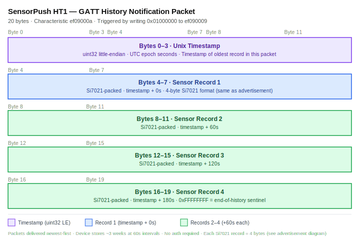
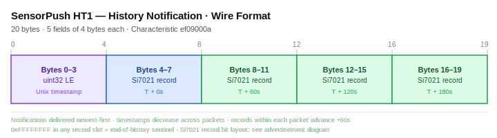
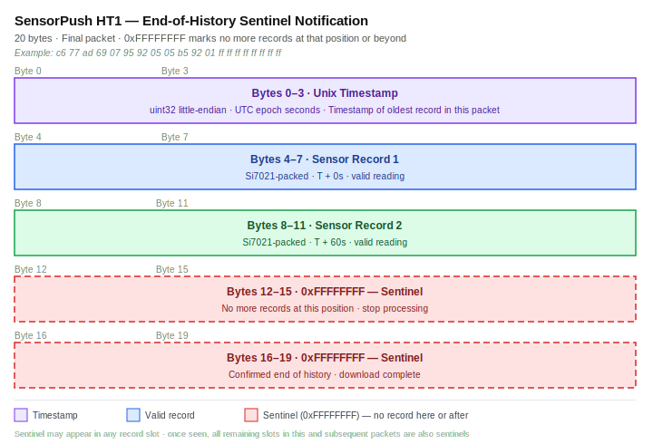
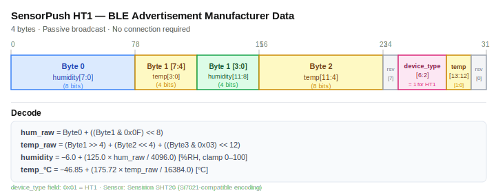

# HT1 History Protocol...Full Research Session Log
**Date:** March 12, 2026
**Outcome:** ✅ History download protocol fully decoded and implemented
**Duration:** ~8 hours

---

## Background

As of March 8, 2026 we had cracked the HT1's **live sensor protocol**...temperature and
humidity readings are broadcast continuously in passive BLE advertisements, encoded in a
4-byte Si7021 bit-packed format. That work is documented in `CONTINUATION.md`.

The **history download protocol** remained unknown. The HT1 stores weeks of readings
internally. Getting that data out requires a GATT connection and interaction with the
reserved characteristics `ef090009` (write) and `ef09000a` (notify). Those characteristics
are explicitly marked RESERVED in SensorPush's official BLE API documentation and are
completely undocumented publicly.

The plan: use an Android device running the Beacon Thermometer app (which does implement
history download) to capture the GATT exchange, then decode the protocol.

---

## Phase 1...Hardware Acquisition

### Samsung Galaxy S6 SM-S906L...Failed (previous session)

A Samsung Galaxy S6 (SM-S906L, TracFone variant) had been set aside for this task. It
failed completely before this session:

- Permanently stuck on **Android 5.0.2 (API 21)**...Samsung never released updates for
  this carrier variant
- The Beacon Thermometer app hard-blocks API 21 at startup via a **native library check**
  in a DexProtector-encrypted asset. Patching `minSdk` in the manifest bypasses install
  but the native runtime check still triggers immediately
- The S6 was repurposed as a dashboard display; a replacement was ordered

### Lenovo Tab M8 2nd Gen (TB-8505F)...Arrived March 12

- MediaTek MT6761 (ARM64), Android 10 (API 29), 2GB RAM, 32GB storage, Wi-Fi only
- Cost: $44.95 (eBay)
- Rationale: Android 10 is well above the app's runtime requirement; Wi-Fi only is fine
  since we communicate via ADB over WiFi

ADB setup was straightforward:
```bash
adb devices                       # USB connection confirmed
adb tcpip 5555
adb connect 192.168.x.x:5555
```

The HT1 was paired with the tablet via the Beacon Thermometer app and completed its
initial sync. Basic setup: done.

---

## Phase 2...HCI Snoop Log (Standard Approach)...Failed

### What We Tried

The standard method for capturing BLE GATT traffic on Android is to enable the
**Bluetooth HCI snoop log** in Developer Options. The BT stack writes every HCI packet
(including all GATT operations with data) to a file, which can be pulled and opened in
Wireshark.

**Step 1...Developer Options**
Settings → About tablet → tap Build number 7× → Developer Options enabled.
Then: Developer Options → Enable Bluetooth HCI snoop log → toggled ON.

**Step 2...Verify the log path**
```bash
adb shell "find /sdcard /data/misc/bluetooth -name '*.log' 2>/dev/null"
# Found: /data/misc/bluetooth/logs/btsnoop_hci.log
# Size: 0 bytes
```

The file existed but was always 0 bytes. Pairing the HT1 and triggering a full history
sync produced no data in the file.

**Step 3...Force via system property**
```bash
adb shell "su -c 'setprop persist.bluetooth.btsnooplogmode full'"
adb shell "su -c 'setprop persist.bluetooth.btsnoopenable true'"
```
Toggled BT off/on to restart the BT stack. File remained 0 bytes.

**Step 4...bt_stack.conf modification**
Located the config file at `/etc/bluetooth/bt_stack.conf`. Appended:
```
BtSnoopLogOutput=true
BtSnoopFileName=/data/misc/bluetooth/logs/btsnoop_hci.log
```

The file is in the read-only system partition. Without root, it can't be modified.
This led directly to the rooting effort.

**Step 5...Magisk module overlay**
After rooting (see Phase 3), created a Magisk module that overlays the config:

```
/tmp/btsnoop-module/
  module.prop
  system/etc/bluetooth/bt_stack.conf  ← modified version with BtSnoopLogOutput=true
```

Zipped, installed via Magisk app, rebooted. The overlay was confirmed active
(`cat /etc/bluetooth/bt_stack.conf` showed the modified version).

Still: **0 bytes** in the log file.

### Root Cause

The Lenovo TB-8505F uses a **MediaTek MT6761 Bluetooth controller** with a proprietary
firmware stack (Connsys). This stack does not implement the standard Android
`BtSnoopLogOutput` config key. The file is created by the BT daemon at startup (so it
exists) but the proprietary MT6761 stack never writes to it.

This is a known issue with MediaTek-based Android devices. The standard HCI snoop
mechanism only works on Qualcomm and some other BT controller implementations.

**HCI snoop was a dead end on this hardware.**

---

## Phase 3...Rooting the Tablet

With root confirmed necessary for the Magisk module approach (and later for Frida), we
needed to root the TB-8505F.

### ZUI Unlock Portal...Failed

Lenovo provides a bootloader unlock portal at `lenovomm.com`. Problems:

1. The page is in Chinese/Japanese with no English version
2. Requires an IMEI number...this is a **Wi-Fi only** tablet with no IMEI
3. Even with the serial number, the CDN URL for the unlock token returned 404:
   ```
   http://cdn.zui.lenovomm.com/developer/tabletboot/HA1MM6J4/sn.img  → 404
   ```

The official unlock path was completely blocked.

### mtkclient...MediaTek BROM Exploit (Success)

The TB-8505F uses the MediaTek MT6761 SoC, which is vulnerable to the **Kamakiri**
exploit...a BROM (BootROM) mode vulnerability that allows unsigned code execution
regardless of bootloader lock state. The `mtkclient` tool implements this exploit.

**Installation:**
```bash
cd /path/to/project
git clone https://github.com/bkerler/mtkclient.git
cd mtkclient
pip3 install -r requirements.txt
```

**Entering BROM mode:**
The MT6761 enters BROM mode when USB is connected while the chip has no valid bootloader
to execute. The procedure:

1. Run `sudo python3 mtk.py da seccfg unlock` on Mac (tool enters waiting state)
2. Power off the tablet completely
3. Hold **Volume Down** only
4. Plug USB cable into Mac while holding Vol Down

The exploit chain fires automatically once the device is detected in BROM mode:
```
[!] Device is in BROM mode
[*] Sending payload...
[*] Unlocking seccfg...
[*] Done. Device will reboot.
```

On reboot, the bootloader displayed an "unlocked device" warning banner...root access
was now possible.

**Installing Magisk:**
1. Read the boot partition:
   ```bash
   sudo python3 mtk.py r boot boot.img
   ```
2. Transfer `boot.img` to the tablet, open in Magisk app → "Patch a file"
3. Pull the patched image back to Mac
4. Write it back:
   ```bash
   sudo python3 mtk.py w boot /tmp/magisk_patched.img
   ```
5. Reboot...Magisk was installed and root access confirmed

**Note on rebooting after BROM mode:**
The tablet does not auto-reboot after the mtkclient exploit. After writing the patched
boot image, the tablet appeared stuck. Required: hold the power button for 10+ seconds to
force power off, then briefly press power to boot normally.

---

## Phase 4...Frida Hooking...Failed (Anti-Tamper)

With root and Magisk established, the next approach was to hook the **Beacon Thermometer
app** (`com.cousins_sears.beaconthermometer`) using Frida to intercept its `BluetoothGatt`
Java API calls in real-time.

### Frida Setup

**Frida server on tablet:**
```bash
# Download frida-server-17.8.0-android-arm64
adb push frida-server /data/local/tmp/frida-server
adb shell "su -c 'chmod 755 /data/local/tmp/frida-server'"
adb shell "su -c 'setenforce 0 && nohup /data/local/tmp/frida-server &'"
```

**Version mismatch (first failure):**
`frida-ps -U` worked (process enumeration), but attaching produced:
```
unable to load libart.so: ANDROID_DLEXT_USE_NAMESPACE is set but extinfo->library_namespace is null
```
Frida 17.8.0 server was incompatible with Android 10 on this MediaTek device. Downloaded
Frida 16.5.9 server instead. Installed matching client in a Python venv:
```bash
python3 -m venv /tmp/frida16-env
/tmp/frida16-env/bin/pip install frida==16.5.9 frida-tools==12.5.0
```
`frida-ps` now worked correctly with the 16.5.9 pair.

**USB transport instability:**
The `-U` (USB) transport connected for process enumeration but crashed during
`create_script()` with `TransportError: the connection is closed`. The frida-server
itself didn't crash (still running at the same PID) but the USB transport was being
dropped during script injection.

**TCP transport fix:**
```bash
adb forward tcp:27042 tcp:27042
```
A minimal test script injected successfully via TCP:
```python
dev = frida.get_device_manager().add_remote_device('127.0.0.1:27042')
session = dev.attach(pid)
script = session.create_script("console.log('hello from frida');")
script.load()
# Output: "hello from frida" ✓
```

### The Anti-Tamper Problem

Every attempt to inject the full GATT capture script caused the app to immediately close
and return to the home screen. The pattern was consistent:
- Frida attaches → hooks load → app exits within 1-2 seconds

Investigation of the APK revealed the cause:
```bash
apktool d /tmp/beacon.apk -o /tmp/beacon_decoded
ls /tmp/beacon_decoded/lib/arm64-v8a/
# libdexprotector.so   ← commercial anti-tamper library
# libsamplestore.so
```

**DexProtector** is a commercial Android security product that:
- Encrypts DEX bytecode (preventing decompilation)
- Detects dynamic instrumentation frameworks (Frida, Xposed)
- Detects debuggers and root
- Kills the app when tampering is detected

Its detection strings were not visible in the binary (encrypted). The detection happens
at runtime via a combination of checks:
- Scanning `/proc/self/maps` for "frida-agent" or similar strings
- Checking for known Frida ports (27042) being open
- Detecting ptrace / debug flag on the process

**Multiple bypass attempts all failed:**

| Attempt | Result |
|---------|--------|
| Rename frida-server to innocuous name | Still detected (port + maps scan) |
| TCP vs USB transport | Detected either way |
| Attach to running process | App exits in <2 seconds |
| `dev.spawn()` then inject before resume | App opened briefly, went to home screen |
| Spawn + `am start` to foreground | New process spawned without hooks |
| Script v2 (avoid abstract method hooks) | Crash due to overload ambiguity error |
| Script v3 (all explicit overloads + try/catch) | Still detected and killed |

The core problem: DexProtector's detection runs as part of the native library constructor,
before any Java code executes. By the time our Frida hooks were active, the detection
had already been triggered. Embedding a Frida gadget in the APK would have the same
problem...DexProtector's integrity check would detect the modified library list.

**Frida was a dead end against this app.**

---

## Phase 5...Logcat Capture (Partial Success)

Even without Frida hooks, Android's `logcat` captures structured log output from apps
and the Bluetooth framework itself. The BT framework (`BluetoothGatt` class) logs
connection state, service discovery, and notification registration at DEBUG level.

```bash
adb logcat -c  # clear buffer
adb logcat -v time | grep -iE "CSSensor|BluetoothGatt|bt_stack|gatt_api" > /tmp/gatt_logcat.txt
# (pair HT1 with app during capture)
```

### What Logcat Revealed

**Connection and service discovery:**
```
D/BluetoothGatt(10884): connect() - device: XX:XX:XX:XX:XX:XX, auto: false
I/bt_stack( 6317): GATT_Connect gatt_if=6, address=ef:2c:a1:48:76:25
D/BluetoothGatt(10884): onClientConnectionState() - status=0 device=XX:XX:XX:XX:XX:XX
E/bt_stack( 6317): bta_gattc_cache_load: can't open gatt_cache_ef2ca1487625  ← No cache yet
I/bt_stack( 6317): GATTC_Discover conn_id=0x0006, disc_type=1, s_handle=0x0001, e_handle=0xffff
```

**Service and characteristic UUID confirmed:**
```
I/CSSensor(10884): Found service ef090000-11d6-42ba-93b8-9dd7ec090aa9
D/BluetoothGatt(10884): setCharacteristicNotification() - uuid: ef09000a-11d6-42ba-93b8-9dd7ec090aa9 enable: true
I/CSSensor(10884): onCharacteristicWrite()
```

**Critical credential error:**
```
E/CSSensorPushAPI(10884): java.lang.Error: No credentials available
E/CSSensorService(10884): java.lang.Error: No credentials available
```

### What Logcat Could NOT Reveal

The `BluetoothGatt` framework logs characteristic UUIDs and connection state but **not
the actual data bytes** of writes or notification payloads. The `CSSensor.onCharacteristicWrite()`
log entry confirms a write happened but gives no payload.

Logcat told us:
- ✅ The service UUID (`ef090000-...`)
- ✅ Notifications are enabled on `ef09000a`
- ✅ A write occurs after notification setup (to `ef090009`, presumably)
- ❌ The actual bytes written to `ef090009`
- ❌ The notification payload from `ef09000a`

And critically: the `No credentials available` error meant the app **requires a
SensorPush cloud account** to proceed with history download. Without logging into the
app with valid credentials, it never sends the history download command. We would have
needed to create a SensorPush account for the capture...but even then, we'd only get
the logcat metadata, not the actual bytes.

**Logcat was a partial success**...it confirmed the service and characteristic UUIDs,
and validated the GATT operation sequence. It could not capture protocol data.

---

## Phase 6...Direct Mac BLE Probe (Success)

### Pivot Insight

We had been treating the Android tablet as a necessary intermediary because we assumed:
1. The app was needed to authenticate with the HT1
2. The HT1 might require a bonded device to allow GATT connections

Both assumptions were wrong. The HT1 is an open GATT server...any BLE central can
connect to it without pairing or authentication.

We already had a working `bleak`-based Python script (`read_ht1.py`) that connected to
the HT1 and read the battery characteristic. The Mac could be its own BLE central.

**The tablet, the app, Frida, and HCI snoop were all unnecessary.**

### Service Discovery

After unpairing the HT1 from the tablet, we ran the probe from the Mac:

```python
async with BleakClient(address) as client:
    for svc in client.services:
        for char in svc.characteristics:
            print(char.uuid, char.properties)
```

**Full service table discovered:**

| Characteristic | Properties | Identified as |
|----------------|------------|---------------|
| `ef090001` | write, read | Device ID (uint24 LE) |
| `ef090002` | read | Firmware/capability flags |
| `ef090003` | write, read | Battery level (0–4 bars) |
| `ef090004` | write, read | Sampling interval in seconds (0x3c = 60) |
| `ef090005` | write, read | Unknown |
| `ef090006` | write, read | Unknown |
| `ef090007` | read | Battery voltage (raw ADC + raw temp) |
| `ef090008` | write, read | Current timestamp (uint32 LE Unix epoch) |
| `ef09000b` | write, read | Unknown |
| **`ef090009`** | **write** | **History command (RESERVED)** |
| **`ef09000a`** | **notify, read** | **History response (RESERVED)** |

Note: `ef090009` is **write-only** (no read property). `ef09000a` is **notify + read**.

### Probing ef090009...First Contact

We enabled notifications on `ef09000a`, then tried a series of write patterns on
`ef090009`. The first command tried was the known SensorPush "standard trigger" pattern
`0x01000000` (uint32 LE = 1), which triggers reads on the temperature/humidity
characteristics on newer SensorPush models:

```python
await client.write_gatt_char(SP_CMD_CHAR, b"\x01\x00\x00\x00", response=True)
```

**Result:** An immediate flood of 20-byte notifications on `ef09000a`. Within seconds,
over 2,800 notifications arrived.

No other commands produced any notifications. The trigger command is precisely and only:
**write `0x01000000` to `ef090009`**.

### Decoding the Notification Format



**Raw notification data (first few, 20 bytes each):**
```
pkt 0:  e2 46 b3 69  6a e4 92 05  6b 04 93 05  6a 14 93 05  6d 24 93 05   |.F.ij...k...j...m$..|
pkt 1:  f2 45 b3 69  6b 44 93 05  6a 54 93 05  6a 64 93 05  6b 84 93 05   |.E.ikD..jT..jd..k...|
pkt 2:  02 45 b3 69  69 a4 93 05  69 b4 93 05  6b d4 93 05  6c f4 93 05   |.E.ii...i...k...l...|
        [-- ts ----] [-- rec 1 -] [-- rec 2 -] [-- rec 3 -] [-- rec 4 -]
```

**Structure:**



**Key observations:**

1. **Timestamps decrease between notifications.** The first notification has the
   most recent timestamp. Each subsequent notification is 240 seconds (4 × 60s)
   earlier. History is delivered newest-first.

2. **Timestamps increase within each notification.** The 4 records within each
   20-byte chunk go forward in time: T, T+60, T+120, T+180.

3. **The sensor data packing is identical to the advertisement format.** The same
   Si7021 bit-packing already reverse-engineered for live readings works perfectly
   for history records:
   ```python
   hum_raw  = byte0 + ((byte1 & 0x0F) << 8)
   temp_raw = (byte1 >> 4) + (byte2 << 4) + ((byte3 & 0x03) << 12)
   humidity = -6.0 + (125.0 * hum_raw  / 4096.0)
   temp_c   = -46.85 + (175.72 * temp_raw / 16384.0)
   ```

4. **End-of-history sentinel:** When there are no more records, the data slots are
   filled with `0xFFFFFFFF`. The final notification was:
   ```
   final:  c6 77 ad 69  07 95 92 05  05 b5 92 01  ff ff ff ff  ff ff ff ff   |.w.i................|
           [-- ts ----] [-- rec 1 -] [-- rec 2 -] [sentinel---] [sentinel---]
   ```
   
   Two records of real data, then two sentinel values. Download complete.

**Validation of decode:**
```
Record: 6ae49205
  hum_raw  = 0x6a + (0x4 << 8) = 1130
  temp_raw = 0xe + (0x920) + (0x1000) = 6446
  humidity = -6.0 + 125.0 * 1130/4096  = 28.46%
  temp_c   = -46.85 + 175.72 * 6446/16384 = 22.27°C = 72.09°F
```

Indoor room temperature, consistent across all records. Decode is correct.

### Download Statistics

- **Total notifications:** 2,826 (each carrying up to 4 records)
- **Total records:** 5,656 after deduplication and sentinel removal
- **Time span:** March 8, 2026 13:23 UTC → March 12, 2026 23:15 UTC (≈4.4 days)
- **Interval:** 60 seconds between records (confirmed by `ef090004` = 0x3c = 60)
- **Download time:** ~4 seconds (BLE throughput was the bottleneck, not the device)

---

## Phase 7...Implementation

The working implementation is in `scripts/ht1_history.py`:

```bash
# Print to terminal
python3 scripts/ht1_history.py

# Save as CSV
python3 scripts/ht1_history.py --csv history.csv

# Save as JSON
python3 scripts/ht1_history.py --json history.json

# Publish to MQTT
python3 scripts/ht1_history.py --mqtt

# Only records since a date
python3 scripts/ht1_history.py --since 2026-03-10 --csv recent.csv
```

The script:
1. Scans for the HT1 by service UUID or local name `"s"`
2. Connects and enables notifications on `ef09000a`
3. Writes `0x01000000` to `ef090009` to trigger history download
4. Collects all notifications until the `0xFFFFFFFF` sentinel
5. Decodes each record using the Si7021 formula
6. Sorts all records oldest→newest, deduplicates, applies date filter
7. Outputs in the requested format

---

## Complete Protocol Reference

**Service:** `ef090000-11d6-42ba-93b8-9dd7ec090aa9`

### History Download

| Step | Action |
|------|--------|
| 1 | Enable notifications on `ef09000a` |
| 2 | Write `0x01000000` (uint32 LE) to `ef090009` with response |
| 3 | Receive 20-byte notifications (newest batch first) |
| 4 | Stop when `0xFFFFFFFF` appears in data bytes |

**Notification format (20 bytes):**


**Record format (4 bytes, Si7021 packing):**



**Sentinel:** `0xFFFFFFFF` in any 4-byte record slot = no more records at that
position or beyond in the current notification.

---

## Key Lessons Learned

### 1. MediaTek BT Stacks Don't Support Standard HCI Snoop

The `BtSnoopLogOutput=true` setting in `bt_stack.conf` only works with the standard
Android BT stack (typically on Qualcomm devices). MediaTek uses a proprietary Connsys
BT firmware that ignores this config entirely. The snoop log file is created at daemon
startup but never written to. This affects the TB-8505F and likely most MediaTek-based
Android devices.

**Implication:** If you need HCI snoop captures on Android, buy a Qualcomm-based device.
The Pixel series and most flagship Snapdragon phones work reliably.

### 2. DexProtector Makes Frida Essentially Unusable

DexProtector is a commercial Android hardening product that detects dynamic analysis
frameworks at the native library constructor level...before any Java code, before Frida
has a chance to install hooks. Common bypass techniques (renaming the server binary,
changing ports, gadget injection) all fail because DexProtector also checks code integrity.

The app (`com.cousins_sears.beaconthermometer`) uses DexProtector specifically because
it accesses the proprietary SensorPush cloud API and SensorPush presumably required the
developer to harden the app.

**Implication:** When you see `libdexprotector.so` in an APK, budget significant extra
effort for dynamic analysis. The gadget-in-APK approach theoretically works but requires
signing bypass and integrity patch, which is a multi-day effort.

### 3. The Direct BLE Approach Was Always Available

The entire Android device chain (tablet → HCI snoop / Frida → capture protocol) was
designed around the assumption that the HT1 requires some form of authentication or
bonding before allowing GATT access to the reserved characteristics. It does not.

Any BLE central...including a Mac laptop...can connect to the HT1 without pairing,
discover all services, and interact with `ef090009`/`ef09000a` freely. In hindsight,
we should have tried `write 0x01000000` directly from the Mac as the very first
experiment, before any Android device work.

**Implication:** Always test the direct BLE connection path first. Only reach for Android
capture infrastructure if the direct approach fails (e.g., if pairing/bonding IS required).

### 4. The Si7021 Packing Is Universal Across All HT1 Interfaces

The bit-packing format reverse-engineered from BLE advertisements (the `read_ht1.py`
work from March 8) applies identically to history records. SensorPush is consistent:
every interface that carries temperature and humidity from the HT1 uses the same
Si7021-style encoding. This made decoding the history notifications trivial once we had
the framing figured out.

### 5. `0xFFFFFFFF` Is a Common BLE Sentinel

Many BLE devices use all-bits-set (`0xFF` per byte) as a "not valid" or "end of data"
marker, borrowed from EEPROM/flash conventions. The HT1's use of `0xFFFFFFFF` as
end-of-history follows this pattern. When probing unknown characteristics, look for
all-`0xFF` values as potential terminators.

### 6. Frida TCP Transport Is More Stable Than USB for Script Injection

The USB transport (`-U` flag / `frida.get_usb_device()`) dropped the connection reliably
at `create_script()`. ADB port forwarding (`adb forward tcp:27042 tcp:27042`) and
connecting via `frida.get_device_manager().add_remote_device('127.0.0.1:27042')` was
stable for injection (when DexProtector wasn't the issue). If USB injection is failing,
try TCP before assuming the problem is the target.

---

## Failed Approaches Summary

| Approach | Time Spent | Why It Failed | What We Learned |
|----------|-----------|---------------|-----------------|
| Standard HCI snoop (Dev Options) | 1h | MediaTek MT6761 ignores the config | Don't use MediaTek for BLE captures |
| `persist.bluetooth.btsnooplogmode` | 30m | Same root cause | System prop ignored by MT6761 stack |
| Magisk module overlay bt_stack.conf | 1h | BT stack still ignores the config | Confirmed MT6761 limitation |
| Frida server v17.8.0 | 30m | Version mismatch with Android 10 on MT6761 | Match Frida versions exactly |
| Frida USB transport | 1h | Transport drops during script inject | Use TCP transport for injection |
| Frida attach to running app | 2h | DexProtector kills app on detection | DexProtector = Frida dead end |
| Frida spawn app | 1h | Spawn doesn't foreground properly; DexProtector still detects | Same conclusion |
| Logcat GATT capture | 30m | Doesn't log data bytes, only metadata | Confirmed UUIDs; can't get payloads |
| Direct BLE from Mac | 30m | **Worked immediately** | Should have tried this first |

Total time on failed approaches: ~7 hours
Time to success after pivoting to direct BLE: ~30 minutes

---

## Files Created This Session

| File | Purpose |
|------|---------|
| `scripts/ht1_history.py` | ✅ Full history download implementation |
| `/tmp/gatt_capture.js` | Frida GATT capture script (educational; blocked by DexProtector) |
| `/tmp/gatt_capture3.js` | Improved Frida script (same fate) |
| `/tmp/ht1_probe.py` | Interactive BLE probe used to discover the protocol |
| `/tmp/btsnoop-module.zip` | Magisk bt_stack.conf overlay (ineffective on MT6761) |

---

## What Remains

The history download protocol is fully decoded and implemented. What the project could
still benefit from:

1. **MQTT integration for history data**...push historical records to InfluxDB on
   first connection, then push only new records on subsequent connections (using
   `--since` flag with the timestamp of the last uploaded record)

2. **Home Assistant custom integration**...fork `Bluetooth-Devices/sensorpush-ble`,
   add history download support as an optional periodic sync alongside the existing
   passive advertisement parser

3. **Protocol publication**...post the complete HT1 GATT protocol as a public
   reference; as of March 2026, no complete public documentation exists for the
   history download mechanism

4. **Battery voltage formula verification**...the formula `raw * 3.6 / 1024` was
   derived from one data point (raw=792 → 2.77V). Collect additional points as
   the battery drains to confirm

5. **ef090004 / ef090005 / ef090006 / ef09000b**...characteristics still not
   fully understood; `ef090004` appears to be the sampling interval in seconds
   (read `0x3c` = 60), the others are unknown

---

