# SensorPush HT1...PCB & Hardware Reverse Engineering

**Date examined:** 2026-03-12
**Status:** Photographed and identified...hardware hacking TBD

---

## Opening the Device

The HT1 enclosure is held together by plastic clips...no screws, no adhesive.
A spudger or fingernail at the seam near the battery compartment is sufficient.
The PCB slides out cleanly.

---

## Chip Identification

### 1. nRF51822...Main SoC (BLE + Application Processor)

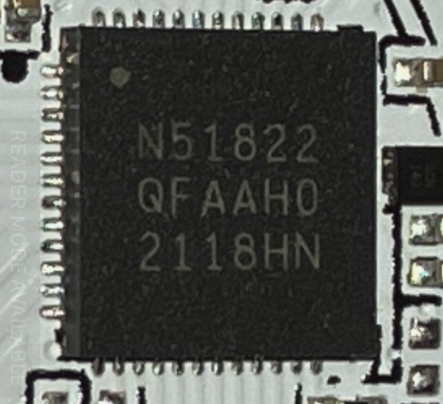

| Field | Value |
|-------|-------|
| Marking | `N51822 QFAA H0` |
| Manufacturer | Nordic Semiconductor |
| Package | QFN48 (6×6mm) |
| CPU | ARM Cortex-M0, 32-bit |
| Flash | 256 KB |
| RAM | 16 KB |
| BLE | Bluetooth Low Energy 4.x (integrated radio) |
| Date code | `2118` = week 18 of 2021 |

The nRF51822 is the heart of the device...it runs the application firmware,
drives the BLE SoftDevice stack, reads the SHT20 over I²C, stores history
in internal flash, and manages the PCB trace antenna.

**Datasheet:** [nRF51822 Product Specification v3.4](https://docs.nordicsemi.com/bundle/nRF51-Series/resource/nRF51822_PS_v3.4.pdf)
**Product page:** [nordicsemi.com/Products/nRF51822](https://www.nordicsemi.com/Products/nRF51822)

---

### 2. SHT20...Temperature & Humidity Sensor

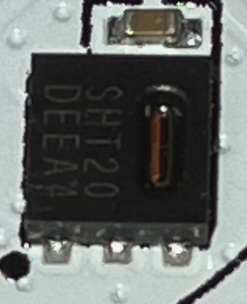

| Field | Value |
|-------|-------|
| Marking | `SHT20` |
| Manufacturer | Sensirion |
| Interface | I²C |
| Temperature range | -40 to +125°C, ±0.3°C typical |
| Humidity range | 0–100% RH, ±3% typical |

Note: The protocol documentation previously referenced Si7021 packing format.
The SHT20 uses the same I²C interface and compatible bit-packing conventions ...
SensorPush's firmware reads raw ADC output and repacks it into the 4-byte
Si7021-compatible format used in BLE advertisements and history notifications.
This is consistent with SensorPush sourcing from multiple sensor suppliers
across production runs while keeping a uniform BLE protocol.

The SHT20 is mounted in a circular PCB cutout that aligns with the humidity
ingress port in the enclosure, allowing ambient air to reach the sensor directly.

---

### 3. Power Management IC

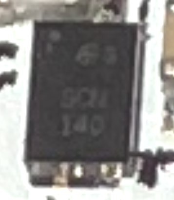

| Field | Value |
|-------|-------|
| Marking | `GC2` (partial...chip oriented inverted in photo) |
| Function | LDO regulator / load switch |
| Purpose | Regulates CR2477 battery voltage (3.0V nominal) to stable 1.8–3.3V for nRF51822 |

The nRF51822 operates from 1.8–3.6V. The CR2477 discharges from ~3.2V to ~2.0V
over its lifetime, making a small regulator or supervisor necessary for reliable
BLE operation at end-of-battery.

Battery voltage is readable via GATT characteristic `ef090007`, byte index 2.
Known data point: `raw=63` → app displays ~2.8V.

---

## PCB Overview

### Component Side (front)

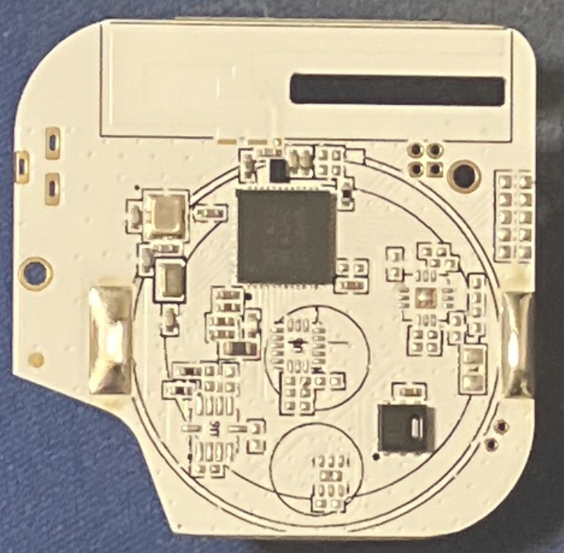

- **nRF51822**...center-top
- **SHT20**...bottom-right, inside circular humidity port cutout
- **Power management IC**...upper-left, near button
- **PCB trace antenna**...the circular ring trace around the entire board perimeter, tuned for 2.4 GHz
- **Button**...upper-left (user-accessible through enclosure)
- **LED**...small component upper-left area
- **Passive components**...0402 resistors/capacitors throughout

### Battery Side (back)

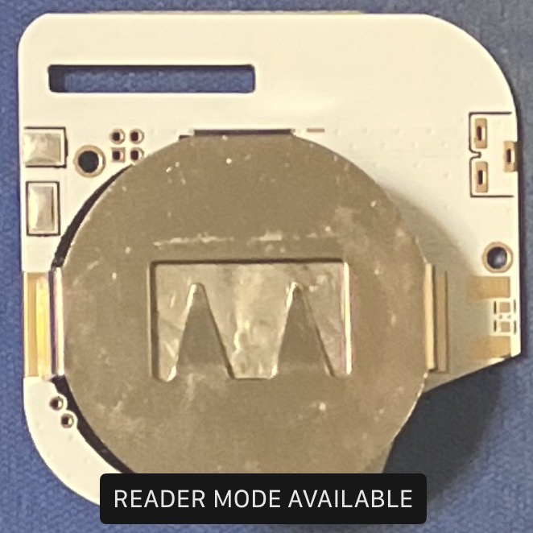

- **CR2477 battery spring contact**...the large M-shaped spring clip dominates the back
- **Two large gold pads**...battery positive/negative contacts
- **Debug/test pads**...visible through-holes accessible from this side (see below)

---

## Debug & Test Interfaces

### SWD Debug Header (4-pad, through-hole)

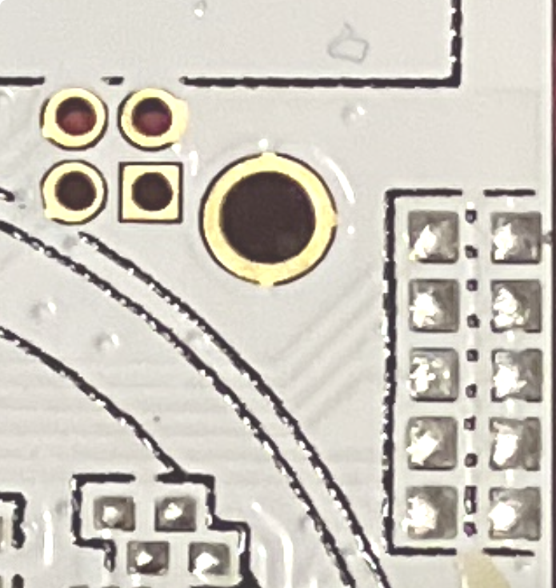

The 2×2 through-hole pad cluster is the **SWD (Serial Wire Debug) programming
and debug interface** for the nRF51822. These pads are used on the production
line to flash firmware before the board goes into the enclosure.

The square pad marks pin 1. Probable pinout (verify with multimeter before connecting):

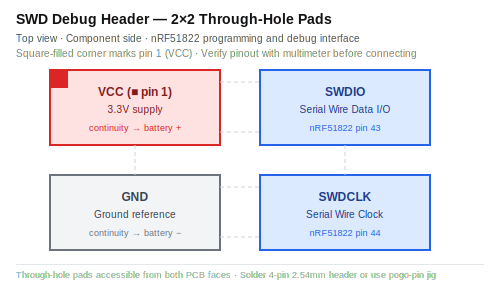

Verify with multimeter:
- VCC pad → continuity to battery positive
- GND pad → continuity to battery negative
- SWDIO → nRF51822 pin 43
- SWDCLK → nRF51822 pin 44

The pads are through-hole, accessible from **both sides of the PCB**...convenient
for soldering a temporary 4-pin header or using a pogo-pin jig.

---

### 10-Pad Test Grid (surface mount, 2×5)


The 2-column × 5-row surface pad grid to the right of the debug header is
a **manufacturing test interface**. Likely provides:

- UART TX / RX (for firmware logging or configuration)
- Additional GPIO test points
- Possibly battery voltage sense line
- Possibly a programming enable signal

The large single through-hole adjacent to the test grid is a **mechanical
alignment pin hole**...used to register the PCB precisely in the production
fixture so bed-of-nails contacts land on the test pads accurately.

**Worth probing:** If a UART debug console was left active in production firmware,
powering the board while monitoring these pads at **115200 8N1** (Nordic SDK default)
may produce log output. A logic analyzer or USB-UART adapter is sufficient.

---

### Battery-Side 4-Pad Group (possible UART or alternate SWD)

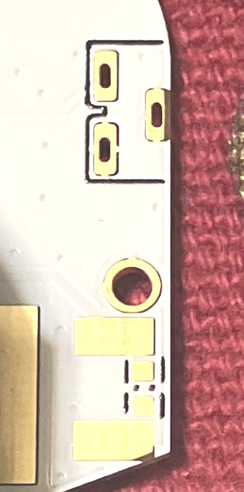

On the battery side, below the alignment hole, is a 4-pad group:
two larger flanking pads + two smaller inner pads.

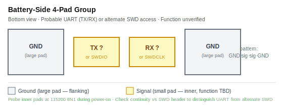

The GND/signal/signal/GND layout is a classic UART test point pattern:
`GND | TX | RX | GND`

Alternatively this could be an alternate SWD access point from the battery
side...so the production fixture can flash without flipping the board.

Probing the inner two pads for continuity against the SWD header on the
component side will determine if they're the same pins (manufacturing
convenience) or different pins (separate UART interface).

---

### Antenna Matching Network Pads

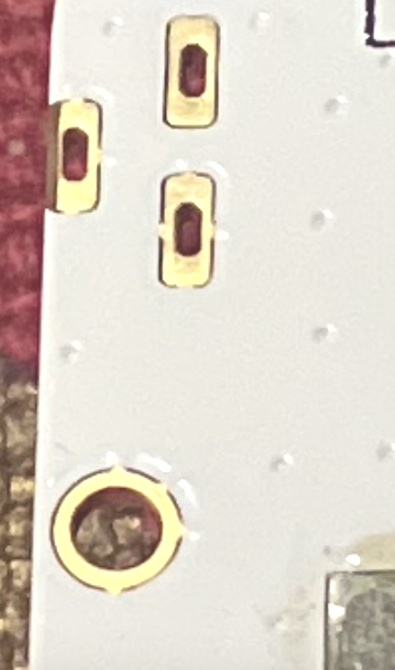

Two unpopulated 0402 footprints near the board edge are **antenna matching
network** positions. These allow RF tuning of the PCB trace antenna by
populating series/shunt components. The fact that they're unpopulated means
the trace antenna hit impedance spec during RF validation without needing
correction components...a well-designed antenna.

The small dots scattered around the board are **fiducial marks**...copper
reference points used by the pick-and-place machine's vision system for
component alignment. No electrical function.

---

## Hardware Attack Surface...Future Work

### What's Possible

| Attack | Difficulty | What we might expect |
|--------|-----------|----------------|
| SWD firmware dump | Low | Full 256KB flash...all firmware, history storage format, all command parsers, unknown characteristic meanings |
| UART console probe | Low | Possibly live debug log output during operation |
| SWD live debug | Medium | Step through firmware execution, inspect memory, watch history writes in real time |
| Firmware disassembly | Medium-High | Complete understanding of all BLE commands, storage format, any hidden features |

### Readback Protection...Decision Tree

The nRF51822 ships with readback protection **disabled** by default.
SensorPush would need to have explicitly called `NRF_UICR->RBPCONF = 0x0000`
to enable it. There is no business reason for a consumer sensor to do this,
and most production firmwares skip it.

**Reading the chip is non-destructive.** The SWD read operation simply clocks
data out over SWDIO/SWDCLK...it cannot damage the device. The only physical
risk is mis-wiring (shorting a pad), which is avoided by verifying pinout with
a multimeter before connecting power.

Follow this decision tree:

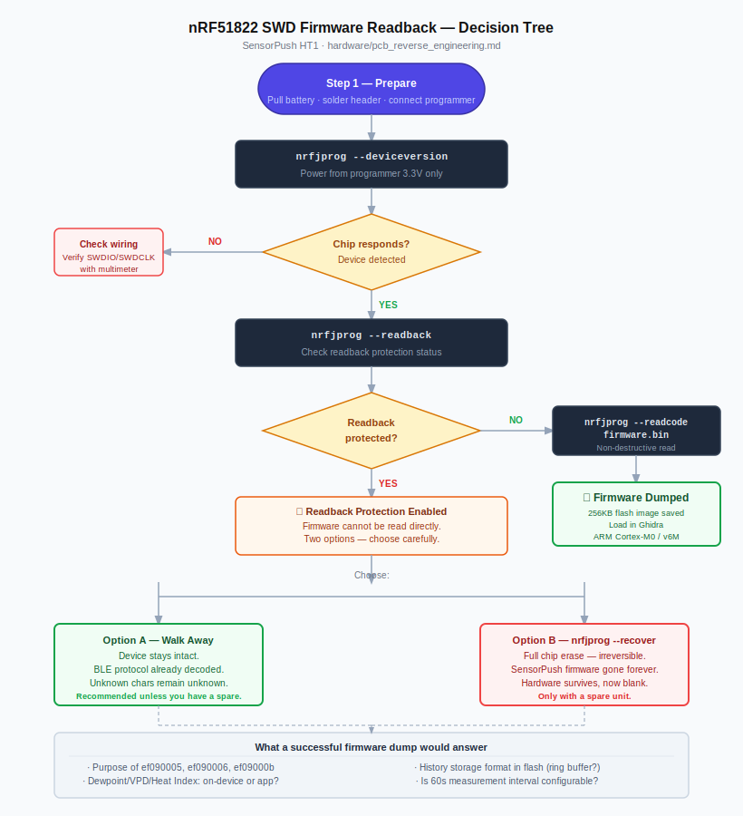

**Most likely outcome:** Protection is disabled, step 3 produces a clean dump.

**What the firmware dump would answer:**
- Purpose of ef090005, ef090006, ef09000b
- Whether dewpoint/VPD/heat index are computed on-device or by the app
- Exact history storage format in flash (ring buffer? indexed? wear-leveled?)
- Whether there are any undocumented BLE commands
- The 60-second measurement interval...is it configurable via a characteristic write?

---

## Required Equipment

### Option 1...ST-Link V2 Clone (~$8-15, recommended for getting started)

Cheap Chinese clone of STMicroelectronics' ST-Link V2 debug probe.
Works with OpenOCD and nrfjprog for nRF51 via SWD.

- Search Amazon or AliExpress for **"ST-Link V2 programmer"**
- Connect: SWDIO → SWDIO, SWDCLK → SWDCLK, GND → GND, 3.3V → VCC
- Guide: [nRF51822 flashing with ST-Link V2](https://forum.esk8.news/t/nrf51822-flashing-setup-in-windows-using-a-stlink-v2/30601)
- macOS script: [nRF51822-OSX-ST_LINK_V2-Flasher-Script](https://github.com/ddavidebor/nRF51822-OSX-ST_LINK_V2-Flasher-Script)

### Option 2...SEGGER J-Link EDU Mini (~$18, official, more reliable)

Official SEGGER debug probe, education/non-commercial use license.
Best-in-class support for Nordic chips...nrfjprog uses J-Link natively.

- **Product page:** [segger.com/products/debug-probes/j-link/models/j-link-edu-mini/](https://www.segger.com/products/debug-probes/j-link/models/j-link-edu-mini/)
- **US shop:** [shop-us.segger.com](https://shop-us.segger.com/product/j-link-edu-mini-8-08-91/)
- Note: EDU license...non-commercial personal use only

---

## Required Software

### nRF Command Line Tools (nrfjprog)

Nordic's official command-line programmer for all nRF5x devices.
macOS, Linux, and Windows.

- **Download:** [nordicsemi.com/Products/Development-tools/nRF-Command-Line-Tools/Download](https://www.nordicsemi.com/Products/Development-tools/nRF-Command-Line-Tools/Download)

```bash
# Check if readback protection is enabled
nrfjprog --readback

# Dump full flash to binary (if unprotected)
nrfjprog --readcode firmware_dump.bin

# Full chip info
nrfjprog --deviceversion
```

### OpenOCD (alternative, works with ST-Link)

Open source on-chip debugger, works with ST-Link V2 clones.

```bash
brew install openocd
openocd -f interface/stlink.cfg -f target/nrf51.cfg
```

### Ghidra (firmware disassembly)

NSA's free reverse engineering tool. ARM Cortex-M0 processor spec
is built in...load the firmware dump directly.

- **Download:** [ghidra-sre.org](https://ghidra-sre.org)
- Processor: `ARM Cortex` → `v6M` (Cortex-M0)
- Language: `ARM:LE:32:v6`

---

## Procedure When Revisiting

1. **Verify pinout**...multimeter continuity from SWD pads to battery contacts (VCC/GND) and nRF51822 pins 43/44 (SWDIO/SWDCLK)
2. **Solder temporary header**...4-pin 2.54mm header into SWD through-holes, or use pogo pins
3. **Connect programmer**...ST-Link V2 or J-Link EDU Mini
4. **Run nrfjprog --readback**...check protection status before anything else
5. **If unprotected:** `nrfjprog --readcode firmware.bin`...done
6. **Probe UART pads**...logic analyzer on 10-pad grid and battery-side 4-pad group, 115200 8N1, during power-on
7. **Load in Ghidra**...ARM Cortex-M0, hunt for history storage and command parser

---

*Photos taken 2026-03-12. Hardware hacking deferred...BLE protocol already fully
decoded via direct Mac BLE probe. SWD/UART work would provide deeper insight into
storage internals and unknown characteristics (ef090005, ef090006, ef09000b).*
